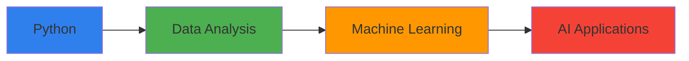

# Hi there! I'm Vaanishka Trivedi 👋

🎯 Exploring the depths of data, one neural network at a time! 
Currently diving into the world of Deep Learning and AI while pursuing my undergraduate studies. 
On a mission to turn data into insights and algorithms into solutions.

[](https://www.linkedin.com/in/vaanishka-trivedi-5b1ab7323/)

<div align="center">

# Hello World! I'm Vaanishka Trivedi 👋
### 📊 Aspiring Data Scientist | AI Enthusiast | Undergraduate Student

[](https://www.linkedin.com/in/vaanishka-trivedi-5b1ab7323/)
[](https://github.com/vaanishka)

```python
class DataScienceStudent:
    def __init__(self):
        self.name = "Vaanishka Trivedi"
        self.role = "Undergraduate Student"
        self.interests = ["Data Science", "AI", "Machine Learning"]
        self.language_spoken = ["Python", "SQL", "Data"]
    
    def say_hi(self):
        print("Thanks for dropping by! Let's explore the world of data together!")

me = DataScienceStudent()
me.say_hi()
```

</div>

## 🎯 Journey Into Data Science



## 💻 Tech Stack

<div align="center">


### 🛠️ Tools I Use


</div>


🎯 Current Focus
- **Learning**: Data Science & AI
- **Working on**: Building my Data Analysis portfolio
- **Exploring**: Machine Learning algorithms

📊 GitHub Stats


